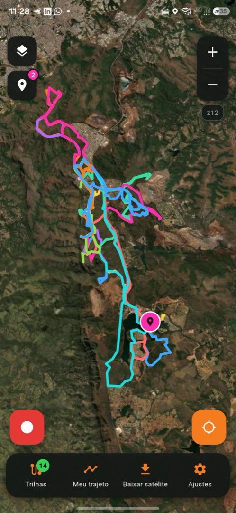
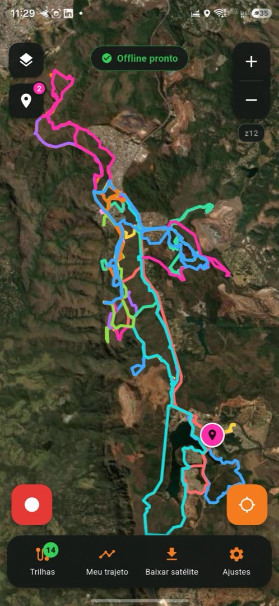
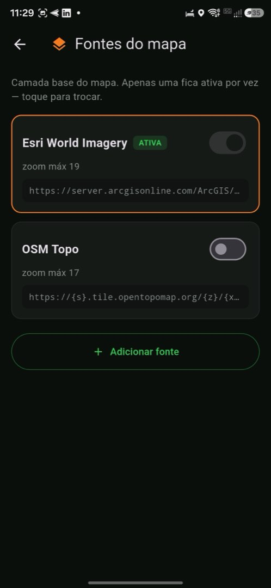
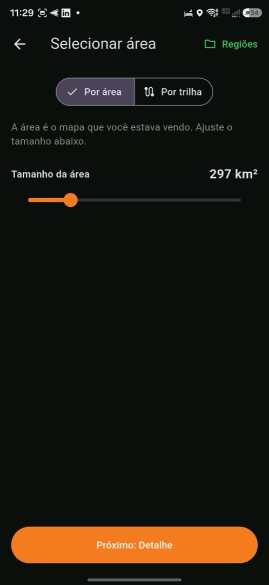
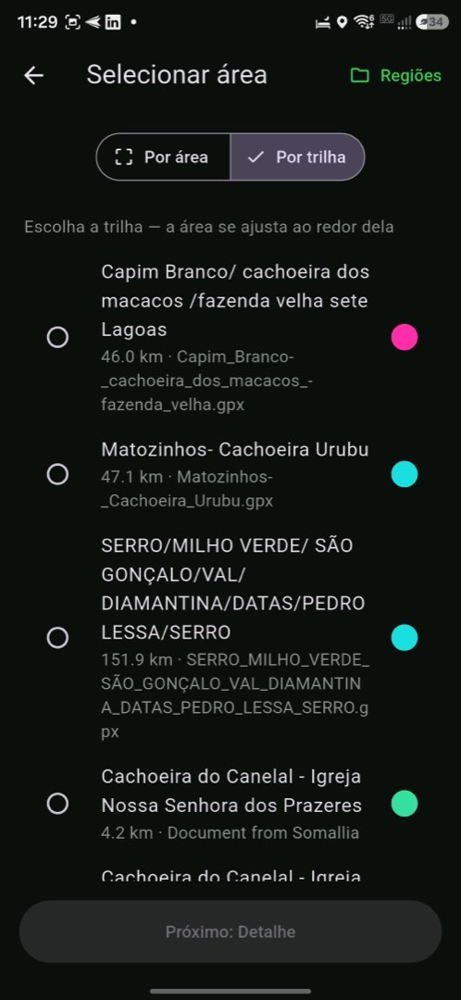
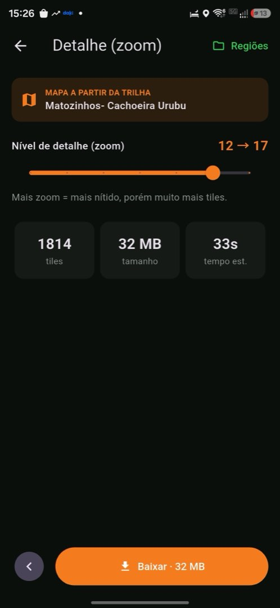
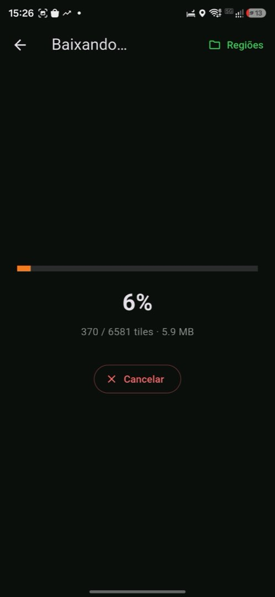
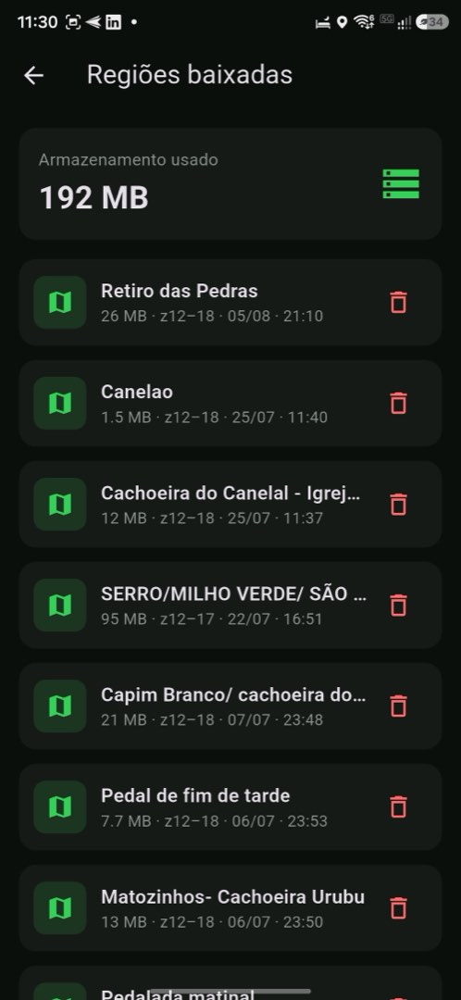
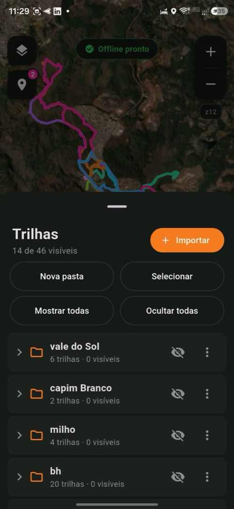

# Soma Trails

**An offline satellite-map app for mountain biking, built to replace a dying app with exactly the workflow I actually use — nothing more.**

[](https://github.com/somacavalieri/soma_trails/actions/workflows/ci.yml)
[](https://flutter.dev)
[](#build--run)
[](LICENSE)



---

## The problem

I ride mountain-bike trails in rural Brazil, where there is no cell signal. For years I depended on **My Trails (Frogsparks)** — an app that is no longer maintained, isn't on the Play Store, and could stop working with any Android update.

What kept me on it was never exclusive technology. It was **workflow convenience**:

1. Downloading satellite imagery for an area **from inside the app** — not generating `.mbtiles` on a desktop with SAS.Planet or MOBAC and copying them over.
2. Opening **many GPX tracks at once**, overlaid, without fighting the UI.

OruxMaps, Locus and AlpineQuest all do this technically. I tried them; the *flow* didn't fit. So instead of adopting a general-purpose app with 200 features I don't use, I built a thin one with the 5 that I do.

**The bet of this project is a product bet, not a technical one:** the hard parts already exist as mature libraries. The value is in ruthless scoping.

## The three things that define success

Everything else in this app is negotiable. These are not:

### 1. My position on offline satellite imagery, with no signal

GPS is satellite positioning — it works with the radio off. The map is the hard part: tiles are cached through FMTC from the very first render, and `maxNativeZoom` enables overzoom, so zooming past the downloaded level scales the imagery instead of showing a gray screen.

| Offline-ready indicator | Configurable tile sources |
|---|---|
|  |  |

Tile sources are user-configurable by URL template — if one breaks on terms-of-service or a URL change, you swap it without a new build. Ships with Esri World Imagery and OSM Topo.

### 2. Downloading satellite tiles by area, from the phone

A three-step wizard. Region selection works two ways — **drag a rectangle**, or **pick an imported track** and let the area snap to its bounding box plus a margin.

| By area | By track |
|---|---|
|  |  |

Then you commit — but never blindly. The wizard shows **tile count, size on disk and estimated time before the download starts**, the transfer reports progress and can be cancelled mid-flight, and downloaded regions are managed and deleted in-app with total storage shown.

| Zoom span & estimate | Progress, cancellable | Downloaded regions |
|---|---|---|
|  |  |  |

The zoom slider spans z12–z18 and defaults to z12–z15. Each extra zoom level multiplies tile count by ~4, and Esri rarely resolves better than z17 over rural Brazil — so the default is deliberately conservative, with overzoom covering the rest. That estimate screen exists because the difference between a sane download and a multi-gigabyte one is a single slider drag.

### 3. Many GPX tracks at once, plus a breadcrumb of where I came from

Import multiple files at once; each track renders in a distinct, editable color, with waypoints as discreet pins. Folders, multi-select, and show-all / hide-all keep 46 imported tracks navigable. Polylines are simplified so a dozen long tracks still pan smoothly.



The recorder draws the path traveled as a distinct line. It **auto-saves GPX straight to disk every ~30 s**, so if Android kills the app mid-ride the track survives — and recording resumes on reopen, marking the gap as a new segment rather than drawing a false straight line.

## Product decisions

The interesting part of a personal tool is what you refuse to build.

| Decision | Why |
|---|---|
| **Android only, sideloaded APK** | One device (Galaxy S24 Ultra), one user. iOS and Play Store are cost with no return here. |
| **The breadcrumb is deliberately light** | Its job is orientation — *"where did I come from?"* — not activity data. Strava and Wikiloc already do rich recording, and I still use them. Detailed stats, segments and charts stay out. |
| **North-up map, no rotation** | The position arrow rotates with heading; the map doesn't. Course-up added complexity for a preference I don't have. |
| **No turn-by-turn, no search, no cloud sync, no social** | Every one of these is a whole subsystem serving a need I don't have on a trail. |
| **Tile sources are user-configurable** | The single biggest durability risk is a tile source disappearing. Making the URL an app setting turns a fatal break into a settings edit. |
| **No Isar for persistence** | Effectively unmaintained. Config goes to `shared_preferences`; tracks and recordings stay **plain GPX + JSON files** on disk. Tiles live in FMTC's ObjectBox store — accepted vendor lock-in, because tiles are re-downloadable. What must survive is the data that isn't. |

The full product doc — locked decisions, MVP scope, risk analysis, implementation plan — is in [`docs/prd.md`](docs/prd.md) (Portuguese). The interactive UI prototype that served as the source of truth for the interface is **[live here](https://somacavalieri.github.io/soma_trails/prototype.html)** ([source](docs/prototype.html)).

## Engineering notes

Three bugs cost real field time and are worth writing down, because none of them fail loudly — they all present as *"GPS just stops"*.

**Never set `distanceFilter > 0` on Android.** Geolocator maps it to the fused provider's `smallestDisplacement`. On One UI this doesn't merely filter updates — it suppresses them until the stream goes silent for good: a handful of fixes, then nothing, even while moving. The fix is time-based updates (`intervalDuration` ~2 s) with distance filtering moved into the app layer, where the recorder keeps points ≥5 m apart.

**`WAKE_LOCK` must be declared in the manifest.** Geolocator's `enableWakeLock: true` acquires a wakelock, but the plugin doesn't declare the permission itself. Without it, `wakeLock.acquire()` throws `SecurityException` during stream setup and the recording stream is **born dead** — normal mode works fine, tapping record freezes. A permission line that isn't yours to declare, failing silently in one code path only.

**Stream rebinds must be serialized with a post-cancel pause.** The Dart-side `cancel()` returns before the plugin's native service finishes tearing down; re-listening immediately yields a mute stream. A 400 ms pause fixes it, and a 30 s watchdog rebinds automatically if the stream goes quiet. A GPS diagnostics panel (fix count, last-fix age, mode, rebind count, last error) is behind Settings → *Diagnóstico do GPS* — built specifically so the next debugging session starts with data instead of guesses.

Underneath all three: **the recorder runs as an Android foreground service with a persistent notification.** Samsung's One UI is the most aggressive battery manager on the market; without it, the breadcrumb stops minutes after the screen turns off — which is precisely the target scenario. This was treated as the project's #1 risk from the PRD onward, not as an implementation detail discovered later.

## Stack

| | |
|---|---|
| **Framework** | Flutter 3.44.4 / Dart 3.12.2 |
| **Map** | [`flutter_map`](https://pub.dev/packages/flutter_map) |
| **Offline tiles** | [`flutter_map_tile_caching`](https://pub.dev/packages/flutter_map_tile_caching) (FMTC, ObjectBox backend) |
| **Location** | [`geolocator`](https://pub.dev/packages/geolocator) + Android foreground service |
| **GPX** | [`gpx`](https://pub.dev/packages/gpx) · [`file_picker`](https://pub.dev/packages/file_picker) |
| **State** | Plain `ChangeNotifier` + listeners — no state-management package |
| **Native** | Keep-screen-on via a `MethodChannel` to `MainActivity.kt` (no wakelock dependency) |

Roughly 6,400 lines of Dart across one screen and a set of single-purpose managers and panels, with 28 tests covering parsing, formatting, track management and the tracks panel.

## Build & run

```bash
flutter pub get
flutter run                      # debug, connected Android device
flutter test                     # 28 tests
flutter analyze                  # clean
flutter build apk --release      # → build/app/outputs/flutter-apk/app-release.apk
```

Release builds need `android/key.properties` pointing at a signing keystore (both git-ignored). A debug build needs nothing extra.

> **Note on AGP:** the build pins **AGP 8.12.0 + Gradle 8.14.2**. The Flutter 3.44 template ships AGP 9.0, which breaks plugins carrying legacy Gradle files — `file_picker`'s plugin classes never reach the app classpath. Don't bump to 9.x without verifying every plugin.

## Status

MVP feature-complete and analyze/test-clean. What remains is field validation, which no test suite can stand in for:

- [ ] **Airplane mode** — reopen with no network: map renders from cache, GPS dot moves, tracks stay drawn.
- [ ] **Screen off, ≥1 h, phone pocketed** — continuous track with no gaps, battery ≲10%/h. The real test of the foreground service.
- [ ] **A full ride on a known trail with no signal.**

## The other half

**Its desk half is [track-viewer](https://github.com/somacavalieri/track-viewer)** — the web app where the GPX collection gets bulk-imported, organised and studied on satellite imagery before a trip. That one plans; this one rides. Each spec declares what the other is for, and the boundary was drawn before either was built.

## License

[GPL-3.0](LICENSE) — required by FMTC, which is GPL-3.0 and sits at the core of the offline tile cache.

This is a personal tool published as a portfolio piece. Tile imagery belongs to its respective providers and their terms of service apply to whichever source you configure; the app ships no API keys and bundles no imagery.

---

Built by [Flavio Soma Cavalieri](https://www.linkedin.com/in/flaviosoma/) — [more projects](https://github.com/somacavalieri).
